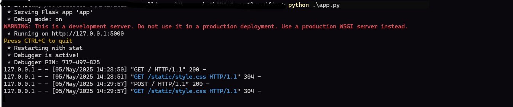
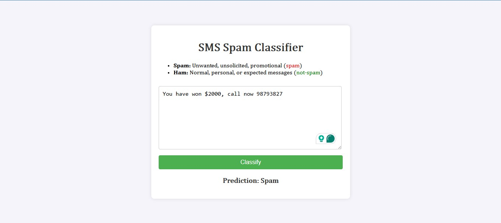
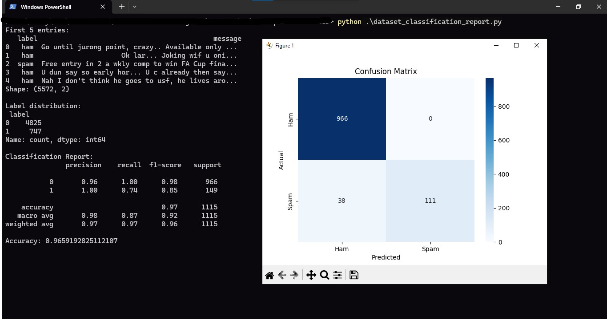
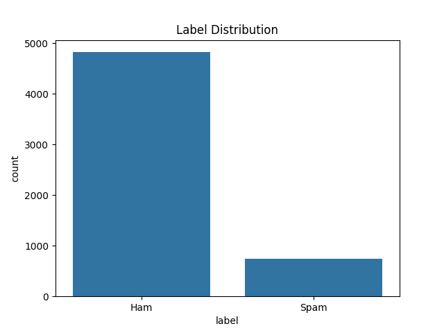

# 📱 SMS Spam Classifier Web App

This is a simple Flask-based web application that uses the Naive Bayes algorithm to classify SMS messages as **Spam** or **Ham (Not Spam)**. The model is trained on the [UCI SMS Spam Collection Dataset](https://archive.ics.uci.edu/ml/datasets/SMS+Spam+Collection).

---

## 🔍 Features

- Upload and preprocess SMS dataset
- Train a Naive Bayes model on the dataset
- Visualize data label distribution
- Show model evaluation metrics (Accuracy, Classification Report)
- Test with your own SMS messages via web form

---

## 🚀 Installation

### 1. Clone the Repository

```bash
git clone https://github.com/rabiulhassandev/ML-SMS-Spam-Detector.git
cd sms-spam-classifier
```

### 2. Install Required Packages

Ensure you have Python 3.6+ and pip installed.

```bash
pip install -r requirements.txt
```

If `requirements.txt` is not present, install manually:

```bash
pip install flask pandas matplotlib seaborn scikit-learn
```

### 3. Download Dataset

Download the [SMSSpamCollection dataset](https://archive.ics.uci.edu/ml/machine-learning-databases/00228/smsspamcollection.zip). Extract and place the `SMSSpamCollection` file (without extension) in the root folder of this project (same location as `app.py`).

---

## 🧠 Run the App

```bash
python app.py
```

Visit [http://127.0.0.1:5000](http://127.0.0.1:5000) in your browser.

---

## 💡 How It Works

1. Loads the SMS Spam Collection dataset.
2. Uses `CountVectorizer` to convert text into numerical features.
3. Trains a Naive Bayes classifier (`MultinomialNB`) to predict spam or ham.
4. Shows accuracy and classification report.
5. Provides a simple HTML interface to classify your own SMS.

---

## 🧪 Example Messages

You can test the app with custom inputs like:

- `"Congratulations! You've won a free iPhone. Call now!"` → **Spam**
- `"Hey bro, are we still meeting for lunch today?"` → **Ham**

---

## 🧠 Also, you can see the Dataset Classification Report (Run)

```bash
dataset_classification_report app.py
```

## 📸 Screenshots

<p align="center">
  
  
  
  
</p>

---

## 📂 Project Structure

```
sms-spam-classifier/
│
├── app.py
├── dataset_classification_report.py
├── SMSSpamCollection          # Dataset 
├── static/
│   ├── plots/
│   │   └── app.jpg
|   |   └── web-ui.jpg # http://127.0.0.1:5000
|   |   └── dataset-report.jpg
|   |   └── label-distribution.jpg
│   └── style.css
├── templates/
│   └── index.html
└── README.md
```
